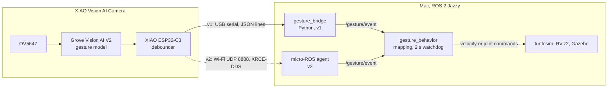

# Gesture-controlled robot

A hand gesture seen by a XIAO Vision AI Camera drives a simulated robot in ROS 2. Rock, paper, and scissors each trigger a distinct robot action. The camera-to-ROS link starts as a Python serial bridge (v1) and is later replaced by micro-ROS over Wi-Fi (v2), without changing anything downstream of the topic. Development runs natively on an M4 Mac.

## Status

| Phase | Work | Status |
|---|---|---|
| 1 | Firmware v1: Arduino sketch reads gestures, debounces, prints JSON over USB | Done |
| 2 | `gesture_msgs` contract and the Python serial bridge | Next |
| 3 | C++ behavior node drives turtlesim, with a safety watchdog | Planned |
| 4 | Hand mimic in RViz2, then hand and TurtleBot3 in Gazebo | Planned |
| 5 | Firmware v2: ESP-IDF, a custom AT client, micro-ROS over Wi-Fi | Planned |
| 6 | Swap the transport, rerun the same tests, benchmark v1 against v2 | Planned |

## Goals

- Rock, paper, and scissors each trigger a distinct, repeatable robot action in simulation.
- A dropped gesture, unplugged camera, or lost Wi-Fi link always stops the robot within about 2 seconds.
- The camera-to-ROS link can be swapped from the Python bridge to micro-ROS with no change to the behavior node, the simulation, or the topic.
- The project produces measurable v1 vs v2 results.

Out of scope: training a custom model, real robot hardware, and continuous hand tracking. The bounding-box center is carried in the message so tracking can be added later.

## Architecture

Both versions share the camera, the debounce code, the topic, and everything on the ROS side after the topic. Only the path from the ESP32-C3 into ROS 2 changes.



| Part | v1 | v2 |
|---|---|---|
| Device framework | Arduino | ESP-IDF with FreeRTOS tasks |
| Vision AI V2 client | Seeed Arduino SSCMA library | Custom AT client over UART |
| Debounce logic | Same C++ files in `firmware/common/` | Same C++ files in `firmware/common/` |
| Device to host | USB serial, JSON lines | Wi-Fi UDP to the micro-ROS agent |
| Publisher of `/gesture/event` | `gesture_bridge` on the Mac | The ESP32-C3 itself |
| Timestamp source | Mac receive time | Device time, synced with the agent |

## Interface contract

The one thing both versions must agree on. A change to it goes into firmware v1, firmware v2, and the bridge in the same commit.

| | |
|---|---|
| Topic | `/gesture/event` |
| Type | `gesture_msgs/msg/Gesture` |
| QoS | Reliable, keep last 10, volatile |
| When published | Immediately when the confirmed gesture changes, plus a heartbeat with the current state every 1 s |
| `frame_id` | `gesture_camera` |

```
uint8 PAPER=0
uint8 ROCK=1
uint8 SCISSORS=2
uint8 NONE=255

std_msgs/Header header
uint8 gesture        # one of the constants above
float32 confidence   # 0.0 to 1.0
float32 bbox_cx      # normalized box center, 0.0 to 1.0
float32 bbox_cy
```

The heartbeat is what makes silence meaningful. The behavior node's watchdog stops the robot after 2 s, or two missed heartbeats, without a message. It also lets a node that starts late learn the current gesture within a second.

## Hardware and software

- **Camera:** XIAO Vision AI Camera, which is a Grove Vision AI V2 (Himax WiseEye2), a XIAO ESP32-C3, and an OV5647 sensor
- **Model:** SenseCraft AI Gesture Detection (rock, paper, scissors), deployed from the SenseCraft web tool
- **Dev machine:** M4 Mac running ROS 2 Jazzy natively through [RoboStack](https://robostack.github.io/) and pixi
- **Simulation:** turtlesim and RViz2 through phase 4, then Gazebo Harmonic
- **Firmware v1:** Arduino IDE with the Arduino-ESP32 core and the Seeed Arduino SSCMA library
- **Firmware v2:** ESP-IDF 5.4 or newer with `micro_ros_espidf_component` (jazzy branch)

## Repository layout

```
gesture_robot/
├── pixi.toml, pixi.lock        # ROS 2 Jazzy environment for the Mac
├── firmware/
│   ├── common/                 # gesture_debouncer.h/.cpp, shared by v1 and v2
│   └── v1_arduino/
│       └── gesture_camera_v1/  # Arduino sketch; debouncer files are symlinks into common/
├── ros2_ws/src/                # ROS 2 packages, from phase 2
└── tests/
    └── debouncer_test.cpp      # host unit tests for the debouncer
```

## Firmware v1

### Debouncer

Detection models flicker between classes on transitional frames, so the device only reports a gesture after seeing it for several frames in a row.

- A gesture is confirmed after **5 consecutive frames** of the same class at **0.60 confidence or higher**.
- A single missed frame doesn't break a streak. A gap longer than 500 ms clears it, so frames on either side of a dropout never count as consecutive.
- After **500 ms** with no usable detection, it reports `NONE` once.
- Model classes map 0 to paper, 1 to rock, 2 to scissors, and anything else to none. `map_class()` is the only place that knows this order.
- It's plain C++ with no Arduino or ESP-IDF calls, so both firmware versions compile the same files and it runs in host unit tests. Timestamps use unsigned arithmetic, so `millis()` wrapping after 49.7 days is handled.

### Serial output

One JSON line per gesture change, plus a heartbeat every second:

```json
{"g":1,"c":0.87,"x":0.512,"y":0.430,"t":48213}
```

`g` is the gesture constant from the message definition, `c` the confidence, `x` and `y` the normalized box center, and `t` the device's `millis()` for debugging. Heartbeats repeat the values from the last change.

### What the hardware showed

None of these were documented reliably, so each was measured on the device:

- **Box `x` and `y` are the center, in a 240×240 frame.** The model's input is 192×192, but the camera rescales boxes to the preview frame before sending them.
- **Scores arrive as 0 to 100**, and the class order is paper 0, rock 1, scissors 2.
- **The camera has its own confidence threshold.** It's device state (`AT+TSCORE`), set from the SenseCraft web tool and kept in flash across power cycles. It's set to 50 so that the debouncer's 0.60 is the threshold that decides.
- **The SSCMA library's `invoke()` arguments are easy to get backwards.** The library builds `AT+INVOKE=<times>,<!filter>,<filter>`, so `AI.invoke(1, false, false)` asks the camera to reply only when the result changes and to include the image. `AI.invoke(1, true, false)` sends `AT+INVOKE=1,0,1`: every frame, results only.

### Flashing

1. In the Arduino IDE, install the **esp32** board package by Espressif Systems and the **Seeed Arduino SSCMA** library. Accept its ArduinoJson dependency.
2. Open `firmware/v1_arduino/gesture_camera_v1/gesture_camera_v1.ino`. The two debouncer files in that folder are symlinks into `firmware/common/`, so don't copy the sketch elsewhere or use Save As.
3. Select board **XIAO_ESP32C3**, keep **USB CDC On Boot** enabled, and pick the `/dev/cu.usbmodem…` port.
4. Upload. If it can't sync, hold BOOT, tap RESET, release BOOT, and try again.
5. Open the Serial Monitor at 115200 baud. Set `LOG_RAW_BOXES` to 1 to also print every raw box.

## Running the tests

The debouncer tests are a self-contained runner with no framework to install. From the repo root:

```bash
mkdir -p build && g++ -std=c++17 -Wall -Wextra -Werror -Ifirmware/common tests/debouncer_test.cpp firmware/common/gesture_debouncer.cpp -o build/debouncer_test && build/debouncer_test
```

The 24 tests cover flicker, low scores, the score threshold, a single missed frame, gaps that break a streak, the 500 ms timeout, switching gestures, unknown classes, and `millis()` wraparound.

## Mac setup

The ROS 2 environment is pinned in `pixi.toml` and `pixi.lock`:

```bash
curl -fsSL https://pixi.sh/install.sh | sh
pixi install
pixi shell
```

Run all ROS 2 commands and `colcon build` inside `pixi shell`. Build ESP-IDF projects from a terminal outside it, so the ROS environment doesn't interfere.

## Failure handling

| Failure | Detected by | Result |
|---|---|---|
| Gesture flicker | Class changes between frames | The debouncer needs 5 matching frames |
| Hand leaves the frame | No usable box for 500 ms | The device reports `NONE` and the robot stops |
| Camera unplugged (v1) | Serial error in the bridge | The bridge retries every 2 s; the watchdog stops the robot |
| Wi-Fi or agent lost (v2) | Agent ping fails | The device waits for the agent; the watchdog stops the robot |
| Vision AI V2 stops sending | No inference result for 2 s | The device restarts inference |
| Corrupt serial data | JSON parse error | The line is dropped and counted |
